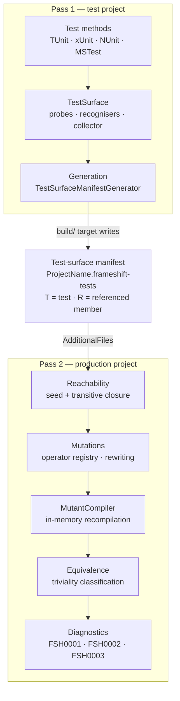

# NetEvolve.Frameshift

[](LICENSE)
[](https://github.com/dailydevops/frameshift/actions)
[](https://github.com/dailydevops/frameshift/graphs/contributors)

This repository contains `NetEvolve.Frameshift`, a Roslyn analyzer package that reports mutation-testing gaps at build time without executing a single test. It generates mutants by rewriting the syntax tree of the production code, checks whether any discovered test can reach the mutated member, and reports the points where a surviving mutant would go unnoticed as ordinary compiler diagnostics. This README is for contributors to the repository itself; if you only want to use the package in your own solution, read the [package README](src/NetEvolve.Frameshift/README.md) instead.

## Overview

The analysis has to run in two passes, and that constraint shapes the whole solution. A test compilation references the production assembly as metadata only: it can name the production members its test methods touch, but it owns no production syntax tree it could mutate. A production compilation owns every syntax tree and the complete call graph, but it cannot see a single test. Neither side alone knows enough.

The **test side** therefore runs first. A test-framework specific analyzer discovers the test methods of the project, walks the code reachable from them inside the test assembly and records every production member they reference. A source generator serialises that list into a _test-surface manifest_ and emits it as a generated source file; the packaged MSBuild target `FrameshiftWriteTestSurfaceManifest` turns that file into `<ProjectName>.frameshift-tests` next to the test project. The manifest is a plain, line-based text file beginning with `frameshift-test-surface/1`, with one documentation comment id per line, prefixed `T` for a test method and `R` for a referenced production member. It is meant to be checked in and diffed.

The **production side** consumes the manifest through `AdditionalFiles`. `MutationCoverageAnalyzer` seeds the reachable set from the recorded member ids, closes it transitively over the production call graph — which only this side can see — walks every syntax tree, generates the candidate mutants, verifies by in-memory recompilation that each one still compiles, and classifies those that cannot change observable behaviour. What remains is reported: `FSH0001` for a meaningful mutant in an unreachable member, `FSH0002` for a mutant without observable effect, `FSH0003` for a manifest that is missing, malformed or stale, and `FSH0004` for a test method that references no production member at all. A project without a manifest stays silent, because it has not opted in; the MSBuild warning `FSHB0001` reports the missing setup instead.



Inside `src/NetEvolve.Frameshift` the code is organised by layer, and each layer is the place to look for exactly one concern:

- **`Analyzers`** — the diagnostic analyzers: one test-surface analyzer per supported test framework, plus `MutationCoverageAnalyzer` for the production side.
- **`TestSurface`** — the manifest format, reader and writer, the framework probes and test-method recognisers, and the registry that makes framework support pluggable.
- **`Generation`** — the incremental source generator that emits the manifest as a generated file, because a generator must never touch the file system.
- **`Mutations`** and **`Mutations/Operators`** — the 14 mutation operators, the registry that indexes them by the syntax kinds they support, the generator that applies them, and the compiler that verifies each mutant.
- **`Equivalence`** — decides whether a mutant is trivial, deliberately one-sided: triviality is only reported when it can be proven, so a real gap is never hidden.
- **`Reachability`** — turns the flat manifest seed into the transitive set of members a test can actually reach, with its limits (reflection, dynamic dispatch) documented in the source.
- **`Configuration`** — the strongly typed options and the `build_property.*` keys the analyzers read.
- **`Diagnostics`** — the diagnostic ids and descriptors, the single source of truth for titles, messages and help links.
- **`build`** — the MSBuild props and targets shipped in the package: manifest discovery, the `CompilerVisibleProperty` declarations, the setup warning and the manifest-writing target.

## Projects

### Analyzer

- **NetEvolve.Frameshift** (`netstandard2.0`) — the analyzers, the source generator and the packaged MSBuild assets. Built with `EnforceExtendedAnalyzerRules`, packed as a development dependency with the assembly under `analyzers/dotnet/cs` and the build assets under `build/` and `buildTransitive/`. See the [package README](src/NetEvolve.Frameshift/README.md).

### Tests

- **NetEvolve.Frameshift.Tests.Unit** (`net8.0`, `net9.0`, `net10.0`) — TUnit unit tests for the operators, the equivalence classifier, the reachability closure, the manifest format and the option parsing. Also hosts the shared test infrastructure.
- **NetEvolve.Frameshift.Tests.Integration** (`net8.0`, `net9.0`, `net10.0`) — TUnit tests that drive whole compilations through the analyzers and the generator end to end, including the manifest round trip.

Both test projects reference the analyzer by project reference and run on TUnit. They additionally reference `xunit.core`, `xunit.v3.core`, `NUnit` and `MSTest.TestFramework` as compile-time-only metadata (`PrivateAssets="all" ExcludeAssets="build;buildTransitive;analyzers"`), so the framework probes can be exercised against the real attribute types without a competing test platform extension entering the run.

## Features

- Reports mutation-testing gaps as build diagnostics, without executing any tests.
- Two-pass design that bridges the test and production compilations through a checked-in, diffable manifest.
- 14 mutation operators covering arithmetic, relational, equality, logical, bitwise, unary, increment/decrement, conditional, null-coalescing, boolean, numeric and string literal mutations.
- Verifies every mutant by in-memory recompilation, so mutants that could never compile are never reported.
- Classifies mutants that cannot change observable behaviour, keeping the warnings actionable.
- Pluggable test-framework support with probes and recognisers for TUnit, xUnit, NUnit and MSTest.
- Configuration entirely through MSBuild properties, with no configuration file to maintain.
- Ships as a development dependency: no runtime footprint in the consuming application.

## Getting Started

### Prerequisites

- [.NET SDK 10.0](https://dotnet.microsoft.com/download) or higher — the newest framework the test projects target. `global.json` pins only the test runner (`Microsoft.Testing.Platform`) and deliberately does not pin an SDK version.
- The .NET 8.0 and .NET 9.0 runtimes, so the tests can run on every target framework. Installing the .NET 8 and .NET 9 SDKs is the simplest way to get them.
- [Git](https://git-scm.com/) for version control.
- [Visual Studio 2022](https://visualstudio.microsoft.com/) (17.14 or newer, for `.slnx` support), [JetBrains Rider](https://www.jetbrains.com/rider/) or [Visual Studio Code](https://code.visualstudio.com/).

### Installation

1. Clone the repository:

   ```bash
   git clone https://github.com/dailydevops/frameshift.git
   cd frameshift
   ```

2. Restore dependencies:

   ```bash
   dotnet restore
   ```

3. Build the solution:

   ```bash
   dotnet build
   ```

4. Run tests to verify installation:

   ```bash
   dotnet test
   ```

## Development

### Building

```bash
dotnet build
```

Package versions are managed centrally in `Directory.Packages.props`; project files reference packages without a version. Do not add a `Version` attribute to a `PackageReference`.

### Running Tests

```bash
# Run all tests, all target frameworks
dotnet test

# Run a single test project on a single target framework
dotnet test ./tests/NetEvolve.Frameshift.Tests.Unit/NetEvolve.Frameshift.Tests.Unit.csproj -f net10.0
```

The test projects declare their kind through assembly-level categorisation attributes in the project file — `NetEvolve.Extensions.TUnit.UnitTestAttribute` and `NetEvolve.Extensions.TUnit.IntegrationTestAttribute` — so `--filter` can select unit or integration tests by category instead of by project path.

### Coverage

Coverage is collected through `Microsoft.Testing.Extensions.CodeCoverage`, which both test projects reference:

```bash
dotnet test ./tests/NetEvolve.Frameshift.Tests.Unit/NetEvolve.Frameshift.Tests.Unit.csproj -f net10.0 -- --coverage --coverage-output-format cobertura --coverage-output unit.cobertura.xml
```

Measure each test project separately, with its own `--coverage-output` file name. Running both in one invocation makes them write to the same output file, and the second run overwrites the first. Pin a single target framework as well, for the same reason. Merge the resulting Cobertura files afterwards if you need a combined number.

### Quality gates

Both gates are enforced by the build itself, so measure them instead of trusting a number written down here:

- `dotnet build ./Frameshift.slnx -c Release` must be free of errors **and** warnings. `NetEvolve.Defaults` turns on `TreatWarningsAsErrors` for `Release`, so a single analyzer warning fails it — and the repository's `.editorconfig` raises several analyzer rules to `error`, which fails `Debug` as well.
- `dotnet test ./Frameshift.slnx` must be green on all three target frameworks of both test projects.

Run both before opening a pull request; CI runs the same commands.

### Code Formatting

```bash
# Format code using CSharpier
csharpier format .
```

CSharpier also runs as part of the build, through the `CSharpier.MSBuild` package referenced globally in `Directory.Packages.props`. In a `Debug` build it reformats the affected files in place; in a `Release` build it only checks and an unformatted file fails the build. Run the command before committing so that CI never fails on formatting alone.

### Project Structure

```txt
src/                                          # Production code
└── NetEvolve.Frameshift/                     # The analyzer package
    ├── Analyzers/                            # Diagnostic analyzers, test side and production side
    ├── Configuration/                        # MSBuild-backed options and their keys
    ├── Diagnostics/                          # Diagnostic ids and descriptors
    ├── Equivalence/                          # Triviality classification of mutants
    ├── Generation/                           # Source generator emitting the manifest
    ├── Mutations/                            # Mutant generation, verification, operator registry
    │   └── Operators/                        # The individual mutation operators
    ├── Reachability/                         # Manifest seed and transitive closure
    ├── TestSurface/                          # Manifest format, probes, recognisers, registry
    ├── build/                                # Packaged MSBuild props and targets
    ├── AnalyzerReleases.Shipped.md           # Released diagnostics
    └── AnalyzerReleases.Unshipped.md         # Diagnostics not yet released

tests/                                        # Test projects
├── NetEvolve.Frameshift.Tests.Unit/          # Unit tests and shared test infrastructure
└── NetEvolve.Frameshift.Tests.Integration/   # End-to-end analyzer and generator tests

docs/
└── rules/                                    # One document per diagnostic, target of the help links

decisions/                                    # Architecture Decision Records (ADRs)
templates/                                    # Documentation templates (READMEs, ADR)
.github/workflows/                            # CI, publishing and maintenance workflows
```

## Architecture

The two decisions that define the shape of this repository are recorded as ADRs:

- [Two-pass mutation analysis](decisions/2026-07-31-two-pass-mutation-analysis.md) — why the analysis is split across the test and production compilations, and why a manifest is the artifact between them.
- [Pluggable test framework support](decisions/2026-07-31-pluggable-test-framework-support.md) — how probes and recognisers keep support for additional test frameworks additive.

Beyond those, two principles run through the code and are worth knowing before changing anything:

- **Errors have a preferred direction.** A false "not trivial" verdict or a false "viable mutant" costs a diagnostic a reviewer can dismiss; a false "trivial" verdict silently hides a real testing gap. Every classification therefore only claims what it can prove.
- **The analysis stays a pure compile-time operation.** No test execution, no file system access from the analyzers or the generator, no network. Anything that cannot be decided from the compilation is a documented limitation, not a workaround.

## Contributing

We welcome contributions from the community! Please read our [Contributing Guidelines](CONTRIBUTING.md) before submitting a pull request.

Key points:

- Follow the [Conventional Commits](https://www.conventionalcommits.org/) format for commit messages
- Write tests for new functionality
- Follow existing code style and conventions
- Update documentation as needed

## Code of Conduct

This project adheres to the Contributor Covenant [Code of Conduct](CODE_OF_CONDUCT.md). By participating, you are expected to uphold this code. Please report unacceptable behavior to [info@daily-devops.net](mailto:info@daily-devops.net).

## Documentation

- **[Package README](src/NetEvolve.Frameshift/README.md)** - Installation, setup and configuration for consumers
- **[Rule Documentation](docs/rules/README.md)** - One document per diagnostic, with causes and remedies
- **[Architecture Decision Records](decisions/)** - Detailed architectural decisions and rationale
- **[Contributing Guidelines](CONTRIBUTING.md)** - How to contribute to this project
- **[Code of Conduct](CODE_OF_CONDUCT.md)** - Community standards and expectations
- **[License](LICENSE)** - Project licensing information

## Versioning

This project uses [GitVersion](https://gitversion.net/) for automated semantic versioning based on Git history and [Conventional Commits](https://www.conventionalcommits.org/). Version numbers are automatically calculated during the build process. The `feat` type raises the minor version, the remaining types raise the patch version, and a `!` marker or a `BREAKING CHANGE:` footer raises the major version.

## Support

- **Issues**: Report bugs or request features on [GitHub Issues](https://github.com/dailydevops/frameshift/issues)
- **Documentation**: Read the full documentation in this repository

## License

This project is licensed under the MIT License - see the [LICENSE](LICENSE) file for details.

---

> [!NOTE]
> **Made with ❤️ by the NetEvolve Team**
> Visit us at [https://www.daily-devops.net](https://www.daily-devops.net) for more information about our services and solutions.
