# NetEvolve.FrameShift

[](LICENSE)
[](https://github.com/dailydevops/frameshift/actions)
[](https://github.com/dailydevops/frameshift/graphs/contributors)

This repository contains `NetEvolve.FrameShift`, a Roslyn analyzer package that reports mutation-testing gaps at build time without executing a single test. It generates mutants by rewriting the syntax tree of the production code, checks whether any discovered test can reach the mutated member, and reports the points where a surviving mutant would go unnoticed as ordinary compiler diagnostics. This README is for contributors to the repository itself; if you only want to use the package in your own solution, read the [package README](src/NetEvolve.FrameShift/README.md) instead.

## Overview

The analysis has to run in two passes, and that constraint shapes the whole solution. A test compilation references the production assembly as metadata only: it can name the production members its test methods touch, but it owns no production syntax tree it could mutate. A production compilation owns every syntax tree and the complete call graph, but it cannot see a single test. Neither side alone knows enough.

The **test side** therefore runs first. A test-framework specific analyzer discovers the test methods of the project, walks the code reachable from them inside the test assembly and records every production member they reference. A source generator serialises that list into a _test-surface manifest_ and emits it as a generated source file; the packaged MSBuild target `FrameShiftWriteTestSurfaceManifest` turns that file into `<ProjectName>.<TargetFramework>.frameshift` next to the test project. The manifest is a plain, line-based text file beginning with `frameshift-test-surface/1`, with one documentation comment id per line, prefixed `T` for a test method and `R` for a referenced production member. It is meant to be checked in and diffed.

The **production side** consumes the manifest through `AdditionalFiles`. `MutationCoverageAnalyzer` seeds the reachable set from the recorded member ids, closes it transitively over the production call graph — which only this side can see — walks every syntax tree, generates the candidate mutants, verifies by in-memory recompilation that each one still compiles, and classifies those that cannot change observable behaviour. What remains is reported: `FSH0001` for a meaningful mutant in an unreachable member, `FSH0002` for a mutant without observable effect, `FSH0003` for a manifest that is missing, malformed or stale, `FSH0004` for a test method that references no production member at all, and `FSH0006` for a mutation point that is reached, but only by tests contributing a single input combination in total — reachable code whose mutation would still go unnoticed. A project without a manifest stays silent, because it has not opted in; the MSBuild warning `FSH0005` reports the missing setup instead.

```mermaid
flowchart LR
    subgraph pass1["Pass 1 — test project"]
        T1["Test methods<br/>TUnit · xUnit v2 · xUnit v3 · NUnit · MSTest"]
        T2["TestSurface<br/>probes · recognisers · collector"]
        T3["Generation<br/>TestSurfaceManifestGenerator"]
        T1 --> T2 --> T3
    end

    M["Test-surface manifest<br/>ProjectName.TargetFramework.frameshift<br/>T = test · R = referenced member"]

    subgraph pass2["Pass 2 — production project"]
        P1["Reachability<br/>seed + transitive closure"]
        P2["Mutations<br/>operator registry · rewriting"]
        P3["MutantCompiler<br/>in-memory recompilation"]
        P4["Equivalence<br/>triviality classification"]
        P5["Diagnostics<br/>FSH0001 · FSH0002 · FSH0003"]
        P1 --> P2 --> P3 --> P4 --> P5
    end

    T3 -->|"build/ target writes"| M
    M -->|"AdditionalFiles"| P1
```



Inside `src/NetEvolve.FrameShift` the code is organised by layer, and each layer is the place to look for exactly one concern:

- **`Analyzers`** — the diagnostic analyzers: one test-surface analyzer per supported test framework _version_ — TUnit, xUnit v2, xUnit v3, NUnit, MSTest — plus `MutationCoverageAnalyzer` for the production side, six `DiagnosticAnalyzer` types in total.
- **`TestSurface`** — the manifest format, reader and writer, the five framework probes and test-method recognisers, and the registry that makes framework support pluggable. The registry lists the probes in one fixed order — TUnit, xUnit v2, xUnit v3, NUnit, MSTest — which decides who reports FSH0003 in a project that uses several of them; a test pins it.
- **`Generation`** — the incremental source generator that emits the manifest as a generated file, because a generator must never touch the file system.
- **`Mutations`** and **`Mutations/Operators`** — the 38 mutation operators, the registry that indexes them by the syntax kinds they support, the generator that applies them, and the compiler that verifies each mutant.
- **`Mutations/RegularExpressions`** — the building blocks for reasoning about regular expression patterns: an options-aware pattern tokenizer, the locator that recognises a pattern in source, and a validity check that answers whether a rewritten pattern is still a legal pattern. The eight operators of the regular-expression pattern family are built on them.
- **`Equivalence`** — decides whether a mutant is trivial, deliberately one-sided: triviality is only reported when it can be proven, so a real gap is never hidden.
- **`Reachability`** — turns the flat manifest seed into the transitive set of members a test can actually reach, with its limits (reflection, dynamic dispatch) documented in the source.
- **`Configuration`** — the strongly typed options and the `build_property.*` keys the analyzers read.
- **`Diagnostics`** — the diagnostic ids and descriptors, the single source of truth for titles, messages and help links.
- **`build`** — the MSBuild props and targets shipped in the package: manifest discovery, the `CompilerVisibleProperty` declarations, the setup warning and the manifest-writing target.

## Projects

### Analyzer

- **NetEvolve.FrameShift** (`netstandard2.0`) — the analyzers, the source generator and the packaged MSBuild assets. Built with `EnforceExtendedAnalyzerRules`, packed as a development dependency with the assembly under `analyzers/dotnet/cs` and the build assets under `build/` and `buildTransitive/`. See the [package README](src/NetEvolve.FrameShift/README.md).

**The analyzer is single-target on purpose, and it stays that way.** Every one of its projects targets `netstandard2.0` alone — that is the one target every host that loads the component can run: the .NET Core-based compiler server of the .NET SDK, the .NET Framework-based one inside Visual Studio, and `csc` on either. There is no target-framework fan-out inside a project; adding one would produce assemblies nothing could ever load. Multi-targeting belongs to the _test_ projects alone.

**The analyzer builds against three Roslyn API surfaces, not one.** `src/NetEvolve.FrameShift/NetEvolve.FrameShift.csproj` is a packing-only project (`EnableDefaultCompileItems=false` — it compiles nothing of its own); it drives a build of each of `NetEvolve.FrameShift.Roslyn4_8.csproj`, `...Roslyn4_14.csproj` and `...Roslyn5_6.csproj` (sharing the same source, via `NetEvolve.FrameShift.Build.props`, each pinned to its own `Microsoft.CodeAnalysis.CSharp` version with `VersionOverride`) and packs each variant's assembly into its own `analyzers/dotnet/roslynX.Y/cs/` folder — `roslyn4.8`, `roslyn4.14`, `roslyn5.6` — instead of the single shared `analyzers/dotnet/cs/` a one-Roslyn-version package would use. An SDK/VS auto-selects the newest folder its own Roslyn version supports (SDK 8.0.400+); there is no `analyzers/dotnet/cs/` fallback, so a host older than 4.8.0 loads no analyzer at all. See `Directory.Packages.props` for why 4.8.0, not 4.4.0 or 4.7.0, is the floor, and the package README's Requirements section for the consumer-facing version.

### Tests

- **NetEvolve.FrameShift.Tests.Unit** — TUnit unit tests for the operators, the equivalence classifier, the reachability closure, the manifest format and the option parsing. Also hosts the shared test infrastructure.
- **NetEvolve.FrameShift.Tests.Integration** — TUnit tests that drive whole compilations through the analyzers and the generator end to end, including the manifest round trip.

Both test projects share one target-framework list, defined once in `Directory.Build.props`:

| Group          | Target frameworks                                 | Runs on        |
| -------------- | ------------------------------------------------- | -------------- |
| Modern .NET    | `net6.0`, `net7.0`, `net8.0`, `net9.0`, `net10.0` | every platform |
| .NET Framework | `net472`, `net48`, `net481`                       | Windows only   |

**Why the classic frameworks are tested but not shipped.** They are in the test matrix and deliberately not in the package, and those are two different questions. The package answer is above: one assembly, `netstandard2.0`, loadable everywhere. The test answer is that the same `netstandard2.0` assembly really does get loaded into a .NET Framework compiler host — that is what happens in Visual Studio — so the code has to be exercised on that runtime, not merely compiled for it. `net472`, `net48` and `net481` are the three .NET Framework versions worth distinguishing here, and they only build on Windows, which is why the list is conditional. Nothing about the _package_ changes with them: they add coverage, not artifacts.

Both test projects reference the analyzer by project reference and run on TUnit. They additionally reference `xunit.core` (xUnit v2), `xunit.v3.core` (xUnit v3), `NUnit` and `MSTest.TestFramework` as compile-time-only metadata (`PrivateAssets="all" ExcludeAssets="build;buildTransitive;analyzers"`), so all five framework probes can be exercised against the real attribute types without a competing test platform extension entering the run. `xunit.v3.core` is referenced conditionally, on the target frameworks it has assets for; the other three are referenced unconditionally.

`xunit.v3.core` is the one package that does not cover the whole matrix: it ships assets for `net472` and for `net8.0` and above, and **none at all for `net6.0` and `net7.0`**. Every reference to an xUnit v3 type is therefore guarded by `#if FRAMESHIFT_XUNIT_V3`, a symbol defined for every target framework except `net6.0` and `net7.0`.

Because xUnit v2 and v3 are separate probes, recognisers and analyzers, that guard now covers the v3 side only. The **xUnit v3** adapter is exercised on six of the eight target frameworks — `net8.0`, `net9.0`, `net10.0`, `net472`, `net48`, `net481` — while the **xUnit v2** adapter, which needs nothing but `xunit.core`, is exercised on all eight, exactly like the TUnit, NUnit and MSTest adapters. Keep such guards as narrow as the reference itself, and never wider than the version that needs them; per-framework `Compile` excludes are not used in this repository.

## Features

- Reports mutation-testing gaps as build diagnostics, without executing any tests.
- Two-pass design that bridges the test and production compilations through a checked-in, diffable manifest.
- 38 mutation operators covering arithmetic and bitwise operators and their compound assignments, relational, equality, logical (including boolean exclusive-or), bitwise/shift, unary, increment/decrement, conditional (branch swap, condition negation and forcing the condition to `true`/`false`), null-coalescing (including the `??=` assignment), boolean, numeric and string literal mutations, a literal of a nullable value type (`bool?`, a nullable numeric type, `char?` or `Guid?`) moved to or from `null` or the underlying type's default value, and collection/array initializer mutations, a parenthesization operator that reassociates a parenthesized additive expression across an enclosing multiplicative one (`(a + b) * c` becoming `a + b * c`), well known `System.String` method calls (`StartsWith`/`EndsWith`, `Trim`/`TrimStart`/`TrimEnd`, `IsNullOrEmpty`/`IsNullOrWhiteSpace`), a `System.Math` method operator (`Sin`/`Cos`, `Asin`/`Acos`, `Tan`/`Atan`, `Sinh`/`Cosh`, `Min`/`Max`, `Floor`/`Ceiling`, and dropping `Abs`), statement removal (`return`, loop `break`/`continue`, `throw` and standalone `void` invocations), checked/unchecked context, the removal of a trailing `StringComparer`/`IComparer<T>`/`IEqualityComparer<T>` argument from an object creation when a same-type overload without it exists, plus a culture-sensitivity family: `StringComparison`, `StringComparer`, `CultureInfo`, `IFormatProvider` argument removal, case conversion and `RegexOptions` flags, plus a regular-expression pattern family that rewrites the pattern text itself: anchors, quantifiers, groups, alternation, character classes, escapes, lookaround and backreferences, plus a LINQ method family that renames well known `System.Linq.Enumerable` calls into their counterpart: `All`/`Any`, `First`/`FirstOrDefault`, `Single`/`SingleOrDefault`, `Last`/`LastOrDefault`, `OrderBy`/`OrderByDescending`, `ThenBy`/`ThenByDescending`, `Min`/`Max`, `MinBy`/`MaxBy`, `Skip`/`Take`, `Skip`/`SkipLast` and `SkipWhile`/`TakeWhile`.
- Verifies every mutant by in-memory recompilation, so mutants that could never compile are never reported.
- Classifies mutants that cannot change observable behaviour, keeping the warnings actionable.
- Pluggable test-framework support with a probe, a recogniser and an analyzer per framework _version_ — TUnit, xUnit v2, xUnit v3, NUnit and MSTest — all five detecting their version by the same rule: the well-known test attribute type resolves, or one of that version's assemblies is referenced. The two xUnit probes resolve `Xunit.FactAttribute` inside their own assembly, `xunit.core` or `xunit.v3.core`, so referencing both versions at once is exact rather than ambiguous.
- Configuration entirely through MSBuild properties, with no configuration file to maintain.
- Ships as a development dependency: no runtime footprint in the consuming application.

## Getting Started

### Prerequisites

- [.NET SDK 10.0](https://dotnet.microsoft.com/download) or higher — the newest framework the test projects target. `global.json` pins only the test runner (`Microsoft.Testing.Platform`) and deliberately does not pin an SDK version.
- The .NET 6.0, 7.0, 8.0 and 9.0 runtimes, so the tests can run on every modern target framework. Installing the matching SDKs is the simplest way to get them; without a runtime the inner build still compiles but its test run cannot start.
- On Windows, the .NET Framework 4.8.1 developer pack, which also provides the reference assemblies for `net472` and `net48`. On Linux and macOS the three .NET Framework targets are dropped from the matrix automatically, so no extra install is needed and no test is skipped silently — the target frameworks simply do not exist there.
- [Git](https://git-scm.com/) for version control.
- [Visual Studio 2022](https://visualstudio.microsoft.com/) (17.14 or newer, for `.slnx` support), [JetBrains Rider](https://www.jetbrains.com/rider/) or [Visual Studio Code](https://code.visualstudio.com/).

### Installation

1. Clone the repository:

   ```bash
   git clone https://github.com/dailydevops/frameshift.git
   cd frameshift
   ```

2. Restore dependencies:

   ```bash
   dotnet restore
   ```

3. Build the solution:

   ```bash
   dotnet build
   ```

4. Run tests to verify installation:

   ```bash
   dotnet test
   ```

## Development

### Building

```bash
dotnet build
```

Package versions are managed centrally in `Directory.Packages.props`; project files reference packages without a version. Do not add a `Version` attribute to a `PackageReference`.

### Running Tests

```bash
# Run all tests, all target frameworks
dotnet test

# Run a single test project on a single target framework
dotnet test ./tests/NetEvolve.FrameShift.Tests.Unit/NetEvolve.FrameShift.Tests.Unit.csproj -f net10.0

# Run one .NET Framework target (Windows only)
dotnet test ./tests/NetEvolve.FrameShift.Tests.Unit/NetEvolve.FrameShift.Tests.Unit.csproj -f net481
```

`dotnet test` without `-f` runs every target framework of the matrix, which on Windows is eight runs per project. Pin a framework with `-f` while iterating; run the full matrix before opening a pull request.

The test projects declare their kind through assembly-level categorisation attributes in the project file — `NetEvolve.Extensions.TUnit.UnitTestAttribute` and `NetEvolve.Extensions.TUnit.IntegrationTestAttribute` — so `--filter` can select unit or integration tests by category instead of by project path.

### Snapshot tests

The generator output and the analyzer diagnostics are pinned with `Verify.TUnit`. Snapshots live in a `_snapshots` directory inside each test project, mirroring the directory structure of the test that owns them; the paths and the serialisation settings come from `tests/NetEvolve.FrameShift.Tests.Unit/Infrastructure/VerifyModuleInitializer.cs`, which the integration project shares through a linked `Compile` item.

A snapshot is written once per test, not once per target framework: the generated manifest and the reported diagnostics are a property of the compilation the test builds, not of the runtime the test happens to execute on. A failing snapshot test writes a `.received.` file next to the accepted one — review the diff, and if the new output is correct, replace the accepted file with it and commit that change together with the code that caused it. Never accept a snapshot you have not read; the whole point of the file is that a reviewer can see the output change.

### Coverage

Coverage is collected through `Microsoft.Testing.Extensions.CodeCoverage`, which both test projects reference:

```bash
dotnet test ./tests/NetEvolve.FrameShift.Tests.Unit/NetEvolve.FrameShift.Tests.Unit.csproj -f net10.0 -- --coverage --coverage-output-format cobertura --coverage-output unit.cobertura.xml
```

Measure each test project separately, with its own `--coverage-output` file name. Running both in one invocation makes them write to the same output file, and the second run overwrites the first. Pin a single target framework as well, for the same reason. Merge the resulting Cobertura files afterwards if you need a combined number.

### Quality gates

Both gates are enforced by the build itself, so measure them instead of trusting a number written down here:

- `dotnet build ./FrameShift.slnx -c Release` must be free of errors **and** warnings. `NetEvolve.Defaults` turns on `TreatWarningsAsErrors` for `Release`, so a single analyzer warning fails it — and the repository's `.editorconfig` raises several analyzer rules to `error`, which fails `Debug` as well. The bar applies to every target framework of every project, including the .NET Framework inner builds, where the available BCL surface differs.
- `dotnet test ./FrameShift.slnx` must be green on **every** target framework of both test projects — no framework may be excluded to make a test pass, and a test that genuinely cannot apply to a framework is guarded by a conditional compilation symbol rather than quietly dropped.

Run both before opening a pull request; CI runs the same commands against the same solution, through the shared `dailydevops/pipelines` workflow. Which target frameworks a given run covers follows from the platform it runs on: the three .NET Framework targets are only in the matrix on Windows. If you develop on Linux or macOS, a `net472`-only break is invisible to you locally — build on Windows, or expect CI to find it.

### Code Formatting

```bash
# Format code using CSharpier
csharpier format .
```

CSharpier also runs as part of the build, through the `CSharpier.MSBuild` package referenced globally in `Directory.Packages.props`. In a `Debug` build it reformats the affected files in place; in a `Release` build it only checks and an unformatted file fails the build. Run the command before committing so that CI never fails on formatting alone.

### Project Structure

```txt
src/                                          # Production code
└── NetEvolve.FrameShift/                     # The analyzer package
    ├── Analyzers/                            # Diagnostic analyzers, test side and production side
    ├── Configuration/                        # MSBuild-backed options and their keys
    ├── Diagnostics/                          # Diagnostic ids and descriptors
    ├── Equivalence/                          # Triviality classification of mutants
    ├── Generation/                           # Source generator emitting the manifest
    ├── Mutations/                            # Mutant generation, verification, operator registry
    │   └── Operators/                        # The individual mutation operators
    ├── Reachability/                         # Manifest seed and transitive closure
    ├── TestSurface/                          # Manifest format, probes, recognisers, registry
    ├── build/                                # Packaged MSBuild props and targets
    ├── AnalyzerReleases.Shipped.md           # Released diagnostics
    └── AnalyzerReleases.Unshipped.md         # Diagnostics not yet released

tests/                                        # Test projects
├── NetEvolve.FrameShift.Tests.Unit/          # Unit tests and shared test infrastructure
│   ├── Infrastructure/                       # Shared harness, linked into the integration project
│   └── _snapshots/                           # Accepted Verify snapshots, mirroring the tests
└── NetEvolve.FrameShift.Tests.Integration/   # End-to-end analyzer and generator tests
    └── _snapshots/                           # Accepted Verify snapshots, mirroring the tests

docs/
└── rules/                                    # One document per diagnostic, target of the help links

decisions/                                    # Architecture Decision Records (ADRs)
templates/                                    # Documentation templates (READMEs, ADR)
.github/workflows/                            # CI, publishing and maintenance workflows
```

## Architecture

The two decisions that define the shape of this repository are recorded as ADRs:

- [Two-pass mutation analysis](decisions/2026-07-31-two-pass-mutation-analysis.md) — why the analysis is split across the test and production compilations, and why a manifest is the artifact between them.
- [Pluggable test framework support](decisions/2026-07-31-pluggable-test-framework-support.md) — how probes and recognisers keep support for additional test frameworks additive, why the unit of the seam is a framework _version_ rather than a framework, and what adding the next one costs: three small files and one registry line.

Beyond those, two principles run through the code and are worth knowing before changing anything:

- **Errors have a preferred direction.** A false "not trivial" verdict or a false "viable mutant" costs a diagnostic a reviewer can dismiss; a false "trivial" verdict silently hides a real testing gap. Every classification therefore only claims what it can prove.
- **The analysis stays a pure compile-time operation.** No test execution, no file system access from the analyzers or the generator, no network. Anything that cannot be decided from the compilation is a documented limitation, not a workaround.

## Contributing

We welcome contributions from the community! Please read our [Contributing Guidelines](CONTRIBUTING.md) before submitting a pull request.

Key points:

- Follow the [Conventional Commits](https://www.conventionalcommits.org/) format for commit messages
- Write tests for new functionality
- Follow existing code style and conventions
- Update documentation as needed

## Code of Conduct

This project adheres to the Contributor Covenant [Code of Conduct](CODE_OF_CONDUCT.md). By participating, you are expected to uphold this code. Please report unacceptable behavior to [info@daily-devops.net](mailto:info@daily-devops.net).

## Documentation

- **[Package README](src/NetEvolve.FrameShift/README.md)** - Installation, setup and configuration for consumers
- **[Rule Documentation](docs/rules/README.md)** - One document per diagnostic, with causes and remedies
- **[Architecture Decision Records](decisions/)** - Detailed architectural decisions and rationale
- **[Contributing Guidelines](CONTRIBUTING.md)** - How to contribute to this project
- **[Code of Conduct](CODE_OF_CONDUCT.md)** - Community standards and expectations
- **[License](LICENSE)** - Project licensing information

## Versioning

This project uses [GitVersion](https://gitversion.net/) for automated semantic versioning based on Git history and [Conventional Commits](https://www.conventionalcommits.org/). Version numbers are automatically calculated during the build process. The `feat` type raises the minor version, the remaining types raise the patch version, and a `!` marker or a `BREAKING CHANGE:` footer raises the major version.

## Support

- **Issues**: Report bugs or request features on [GitHub Issues](https://github.com/dailydevops/frameshift/issues)
- **Documentation**: Read the full documentation in this repository

## License

This project is licensed under the MIT License - see the [LICENSE](LICENSE) file for details.

---

> [!NOTE]
> **Made with ❤️ by the NetEvolve Team**
> Visit us at [https://www.daily-devops.net](https://www.daily-devops.net) for more information about our services and solutions.
