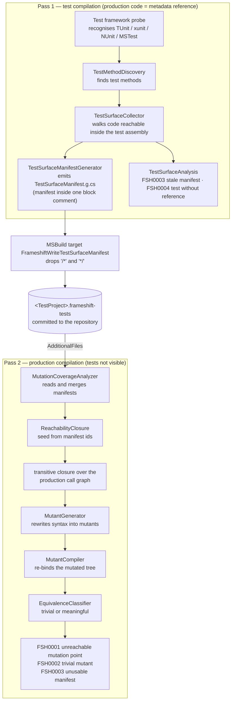

---
authors:
  - Martin Stühmer

applyTo:
  - "src/NetEvolve.Frameshift/Analyzers/**/*.cs"
  - "src/NetEvolve.Frameshift/Generation/**/*.cs"
  - "src/NetEvolve.Frameshift/TestSurface/**/*.cs"
  - "src/NetEvolve.Frameshift/Reachability/**/*.cs"
  - "src/NetEvolve.Frameshift/build/*"

created: 2026-07-31

lastModified: 2026-07-31

state: accepted

instructions: |
  Frameshift detects mutation-testing gaps by static analysis at build time and never executes a test.
  The analysis is split across two compilations, because a test compilation sees production code only as
  a metadata reference and owns no syntax tree to mutate, while a production compilation cannot see the
  tests. The test compilation records its test methods and the production members they reference; the
  `TestSurfaceManifestGenerator` emits that as a generated source file and the MSBuild target
  `FrameshiftWriteTestSurfaceManifest` writes it to `$(MSBuildProjectName).frameshift-tests` next to the
  test project, where it is committed. The production compilation reads that manifest through
  `AdditionalFiles`, seeds `ReachabilityClosure` with the recorded member ids, closes the set over the
  production call graph — which only this side can see — generates mutants by rewriting syntax, verifies
  each by re-binding the mutated tree, and reports FSH0001 (unreachable mutation point), FSH0002
  (trivial mutant) and FSH0003 (unusable or stale manifest). The manifest is a dependency-free
  line-oriented text format (`frameshift-test-surface/1`, `T `/`R ` lines of documentation comment ids),
  because a netstandard2.0 analyzer assembly must add no dependency. Because tests are never run, the
  reported concepts are reachability and triviality, never a mutation score.
---

# Decision: Two-pass, build-time mutation analysis bridged by a committed test-surface manifest

Frameshift reports mutation-testing gaps as compiler diagnostics during a normal build and never
executes a test. The analysis cannot live in a single compilation, so it is split into a test-side pass
that records which production members the tests touch and a production-side pass that mutates the code
and decides which mutation points no test can reach. A committed plain-text *test-surface manifest* is
the only artifact that crosses between them.

## Context

A Roslyn `DiagnosticAnalyzer` and an `IIncrementalGenerator` both run per compilation, and neither
compilation involved in mutation analysis can see enough on its own.

- **The test compilation cannot mutate.** It references the production assembly as a
  `PortableExecutableReference`. Production members are available as `ISymbol` instances, so the
  analysis can name what a test method touches, but there is not a single production `SyntaxTree` in
  that compilation. A mutant is produced by rewriting syntax and verified by re-binding the rewritten
  tree, and neither is possible against metadata.
- **The production compilation cannot see tests.** It owns every production syntax tree and the whole
  call graph, but the test projects reference it, not the other way round. The set of members a test
  exercises is simply not derivable there.
- **Inverting the reference is a build cycle.** Making the test project reference and analyse production
  *sources* would mean the production project needs the test project's analysis result as an input while
  the test project still needs the production assembly to compile. That is a dependency cycle MSBuild
  cannot schedule, whatever shape it is given.
- **Not executing tests is a deliberate constraint, not an omission.** No test host is started, no
  process is spawned per mutant, there are no timeouts to tune and no flaky test can change the result.
  The same inputs always produce the same diagnostics, and the cost stays inside the envelope of a
  normal build, which is what allows the findings to appear in the IDE's error list while typing and in
  CI without a separate pipeline stage.
- **An analyzer assembly may not take dependencies.** The package targets `netstandard2.0` with
  `EnforceExtendedAnalyzerRules` enabled and ships as `analyzers/dotnet/cs`. Any assembly it needed at
  run time would have to be shipped alongside and would risk colliding with whatever the compiler host
  already loaded. `System.Text.Json` is not available on that target without adding a package, so no
  serializer may be assumed. A generator additionally must not touch the file system at all.

## Decision

The analysis is two passes over two compilations, bridged by a manifest that is written by the build and
committed to the repository.

### Pass one — the test side produces the manifest

- A framework-specific analyzer (`TUnitTestSurfaceAnalyzer`, `XunitTestSurfaceAnalyzer`,
  `NUnitTestSurfaceAnalyzer`, `MSTestTestSurfaceAnalyzer`) hands its `ITestFrameworkProbe` to the shared
  `TestSurfaceAnalysis`. Nothing happens unless the probe recognises its framework **and** at least one
  test method is discovered: a compilation whose tests cannot be seen is never judged.
- `TestSurfaceCollector` walks the executable code reachable from the discovered test methods *inside the
  test assembly* — method bodies, expression bodies, constructor initializers, member initializers — and
  records every referenced member that comes from outside the compilation, i.e. from the assemblies under
  test. Attribute usages and signatures are skipped, because they describe the test rather than the
  production code it exercises. Test methods and referenced members are stored as documentation comment
  ids produced by `DocumentationCommentId`.
- `TestSurfaceManifestGenerator` collects the same surface and emits it as the generated source file
  `TestSurfaceManifest.g.cs`. A generator has no sanctioned way to write a file, so the manifest travels
  as source: the whole emitted file is one block comment whose first line is exactly `/*`, whose last
  line is exactly `*/` and whose intermediate lines are verbatim manifest lines. Such a file is valid C#
  that contributes nothing to the compilation.
- The packaged target `FrameshiftWriteTestSurfaceManifest` runs `AfterTargets="CoreCompile"`, reads that
  generated file, drops its first and last line and writes the remainder to
  `$(FrameshiftTestSurfaceManifestFile)`, which defaults to
  `$(MSBuildProjectDirectory)\$(MSBuildProjectName).frameshift-tests`. The sibling target
  `FrameshiftConfigureTestSurfaceManifest` decides whether this project writes a manifest at all (based
  on a referenced TUnit, xunit, NUnit or MSTest package unless
  `FrameshiftWriteTestSurfaceManifest` is set explicitly), elects exactly one inner build of a
  multi-targeting project as the writer, turns on `EmitCompilerGeneratedFiles`, and removes the test
  project's own manifest from its `@(AdditionalFiles)` so that a test project is never judged against
  itself. The file is written with `WriteOnlyWhenDifferent="true"`, so an unchanged surface does not
  invalidate the build.
- On every later build, `TestSurfaceAnalysis` compares the freshly collected surface with the manifest on
  disk and reports `FSH0003` on the manifest file when the id sets differ. Only the id sets are compared,
  never the text, so formatting can never cause a false positive. `FSH0004` reports a test method that
  references no production member at all.

### The manifest — the artifact that crosses the boundary

The manifest is committed next to the test project. It is a build output, but it is also the input that
the production compilation needs *before* anything in the test project has been built, which is exactly
why it lives in source control rather than in `obj`.

The format is defined by `TestSurfaceManifestFormat` and is deliberately line-oriented plain text:

```text
frameshift-test-surface/1
# lines starting with '#' are comments and are ignored
T M:Contoso.Tests.CalculatorTests.Add_ReturnsSum
R M:Contoso.Calculator.Add(System.Int32,System.Int32)
R T:Contoso.Calculator
```

The first non-empty, non-comment line must be the header `frameshift-test-surface/1`. A `T ` line carries
the documentation comment id of a discovered test method, an `R ` line the id of a referenced production
member. `TestSurfaceManifestWriter` sorts both groups ordinally and separates lines with a single line
feed, so the file is canonical and produces no diff churn.

It is not JSON. A netstandard2.0 analyzer assembly may not add a dependency, so JSON would mean either
shipping a serializer next to the analyzer or hand-writing a parser — and a hand-written JSON parser is
strictly more code and more failure modes than reading a header line and a prefixed id per line. The
text format also survives the trip through the block comment of the generated file and through
MSBuild's `ReadLinesFromFile`/`WriteLinesToFile`, both of which are line-oriented, and it merges by
simple set union when a production project consumes several manifests. Line-oriented text is
additionally reviewable in a pull request, which a serialized blob is not.

### Pass two — the production side mutates and judges

`MutationCoverageAnalyzer` runs on the production compilation. Per compilation it selects every
`AdditionalText` whose path ends in `.frameshift-tests`, parses them with `TestSurfaceManifestReader`,
unions the successfully parsed ones, and reports `FSH0003` for each file it cannot use. It then hands the
merged manifest to `ReachabilityClosure`, walks every syntax tree once, and for each candidate mutation
produced by the operators in `MutantGenerator`: verifies with `MutantCompiler` that the mutant still
compiles, classifies it with `EquivalenceClassifier`, and attributes it to the enclosing member. A
meaningful mutant in an unreachable member is `FSH0001`; a mutant that cannot change observable
behaviour is `FSH0002`. A project with no manifest at all stays completely silent — it has not opted in,
and the MSBuild warning `FSH0005` addresses the missing setup instead.

**Why the transitive closure belongs on the production side.** The manifest records only what a test
touches *directly*, because that is all the test compilation can determine: it can resolve
`calculator.Add(1, 2)` to a symbol, but it cannot see the body of `Add`, so it cannot know that `Add`
calls `Validate`, which calls `Normalize`. Those edges exist only in the production compilation's syntax
trees. `ReachabilityClosure` therefore treats the manifest as a *seed* and performs a breadth-first
expansion where the trees are: for every reachable member declared in this compilation it walks the
executable code, adds every invocation, property, indexer, event, field or object creation it resolves
to, and queues the newly added members. Virtual and interface dispatch is approximated by adding, for
every reachable virtual, abstract or interface member, the overrides and implementations declared in this
compilation. Putting the closure on the test side would require the whole production call graph to be
serialized into the manifest — orders of magnitude larger, and stale the moment any production body
changes.



## Consequences

### Benefits

- **Deterministic.** The result is a function of the sources, the manifest and the configuration. There
  is no test host, no scheduling, no timeout and no flaky test, so the same inputs always yield the same
  diagnostics — the same on a developer machine as on a build agent.
- **Fast enough for a normal build.** No process is started per mutant. The most expensive step,
  verification, re-binds only the mutated tree, and results are memoised per mutation identity;
  `FrameshiftMaxMutantsPerMember` (default 64) caps a pathological member.
- **Works everywhere a compiler runs.** The findings are ordinary diagnostics, so they appear in the
  IDE's error list, in `dotnet build` output and in CI logs, and they can be escalated or suppressed with
  `.editorconfig` and `TreatWarningsAsErrors` like any other analyzer diagnostic.
- **No phantom findings from impossible mutants.** Every candidate is verified by recompilation before it
  is reported, so a rewrite that does not build is never presented as a gap. (`FrameshiftVerifyMutantCompilation`
  can turn this off; the default is `true`.)
- **The manifest is reviewable.** A change to the tested surface shows up as a readable diff in a pull
  request.

### Costs and risks

- **The manifest is a build artifact in source control.** It must be committed, it appears in diffs, and
  a contributor who does not build the test project can leave it behind. Staleness is detected rather
  than prevented: the test side reports `FSH0003` when the recorded ids no longer match the tests, and
  the production side reports `FSH0003` when a manifest records nothing or when none of its ids resolve
  in this compilation. Rebuilding the test project regenerates it.
- **A static closure has blind spots, and they produce false `FSH0001`.** Reflection is not followed, so
  a member reached only through `Type.GetMethod` or `Activator` looks unreachable. Dependency injection
  is not followed; only the syntactic implementation and override relationships bridge that gap. A
  delegate stored in a field, property or collection is recorded where it is created but the later
  invocation through the field is not connected to it. Source generators are never run or reasoned
  about — generated trees are walked like any other tree, but generated members that no source code
  references stay unreachable. Members without a declaring syntax, most notably implicitly declared
  default constructors, contribute no outgoing references. Every one of these errs towards reporting a
  gap a human can dismiss instead of silently claiming coverage that does not exist.
- **Verification costs build time.** Re-binding a tree is the most expensive operation in the analyzer,
  and it happens once per distinct mutant — the cache key is the operator id together with the file path
  and the source span it rewrites, so one mutation point still pays for each of its mutants, but only
  once each. Only the mutated tree is asked for diagnostics, never
  the whole compilation, which keeps the cost linear at the price of accepting a mutant that would break
  code in a *different* file as viable. The manifest generator depends on the whole `Compilation` and
  therefore cannot be incremental; it re-runs on every build and every keystroke in the IDE.
  `FrameshiftEnabled=false` switches the analysis off, `FrameshiftWriteTestSurfaceManifest=false`
  keeps the analysis but stops the writing.
- **No surviving-versus-killed distinction, and therefore no mutation score.** Deciding whether a test
  *fails* for a mutant requires running that test against that mutant. Frameshift never does, so it
  cannot and does not report a mutation score, a kill rate or a survivor list. What it reports instead is
  reachability — can any test reach this mutation point at all — and triviality — could this mutant
  change observable behaviour at all. An unreachable mutation point is a guaranteed survivor; a reachable
  one is not thereby proven killed. This is the honest boundary of the approach and the reason the
  diagnostics are worded the way they are.

## Alternatives Considered

- **Execute the tests once per mutant from a runner.** This is the only way to obtain a true
  surviving-versus-killed verdict and a mutation score. Rejected: it needs a process per mutant or per
  batch, and therefore a test host, timeouts, flakiness handling and infrastructure that is a build step
  of its own rather than a compiler diagnostic. The cost is orders of magnitude above a build, the result
  is no longer deterministic, and none of it can run inside the IDE while typing. The whole point of this
  design is a finding that shows up in the editor.
- **Embed every mutant in one compilation behind runtime switches.** Compile once with each mutation
  guarded by a condition on an environment variable or static flag, then run the test suite repeatedly
  with different switches. This avoids recompiling per mutant. Rejected: it still requires executing the
  tests, it rewrites the production sources into something that is not the program that ships, the
  guards change inlining and code shape and can therefore change behaviour and timing, and a build
  producing an instrumented assembly is dangerously close to shipping one.
- **Mutate IL after compilation.** Rewriting the emitted assembly avoids the C# recompilation cost
  entirely and can express mutations that do not have a clean syntactic form. Rejected: the findings
  could no longer be reported as diagnostics anchored to a source location without a mapping layer of its
  own, the analysis would need an IL rewriting library — a dependency an analyzer assembly may not take —
  and it happens after the compiler has finished, which puts it outside the IDE entirely. `Debug` and
  `Release` IL also differ enough that findings would depend on the configuration.
- **A solution-wide analysis over `MSBuildWorkspace` instead of a compile-time analyzer.** One process
  could load the whole solution, see production and test projects at once, and skip the manifest
  completely — no second pass, no committed artifact, no staleness. Rejected: it is a separate tool
  invocation, not part of the build, so nothing appears in the IDE or in a normal `dotnet build`; it
  needs its own MSBuild resolution and duplicates what the compiler already did; and it cannot be
  delivered as an analyzer package that a project simply references. The manifest is the price paid for
  living inside the compiler, and it buys IDE and CI integration for free.
- **A code fix that maintains the manifest.** A `CodeFixProvider` on `FSH0003` that rewrites the manifest
  would remove the "rebuild the test project" step. Rejected on a hard technical limit: `FSH0003` is
  anchored on the manifest, which is an `AdditionalText`, and the code fix infrastructure only ever hands
  out a `Document` and only ever accepts changes to `Document`s and `Project`s in the returned
  `Solution`. There is no supported way for a code fix to change an additional file. The source generator
  plus the MSBuild target achieves the same automation through channels that are supported.

## Related Decisions

- [Pluggable Test Framework Support](./2026-07-31-pluggable-test-framework-support.md) — the seam this
  decision depends on. The two-pass split says *that* a test-side pass must produce the manifest; that
  decision defines *how* the test side recognises a framework's test methods, which is what makes pass
  one work for TUnit, xunit, NUnit and MSTest alike.