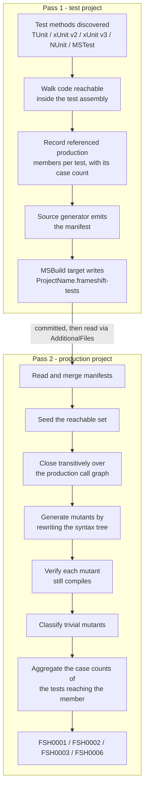

# NetEvolve.FrameShift

[](https://www.nuget.org/packages/NetEvolve.FrameShift/)
[](https://www.nuget.org/packages/NetEvolve.FrameShift/)
[](https://github.com/dailydevops/frameshift/blob/main/LICENSE)

FrameShift is a Roslyn analyzer package that reports mutation-testing gaps in C# code at build time,
without executing a single test. It mutates the production syntax tree in memory, checks whether any
discovered test can reach the mutated code, and warns where a surviving mutant would go unnoticed.
It is for teams who want the signal of mutation analysis inside the normal build and in the IDE,
next to every other compiler diagnostic.

## Features

- Build-time gap detection - the analysis runs inside the compiler, so nothing is executed,
  scheduled or spawned, and the result appears in the build log and in the IDE error list.
- 36 mutation operators covering arithmetic operators and compound assignments, relational and
  equality operators, logical operators (including boolean exclusive-or), conditional expressions
  (branch swap, condition negation, and forcing the condition to `true`/`false`), bitwise/shift
  operators and their compound assignments, logical negation, increment/decrement, unary operators,
  null-coalescing (including the `??=` assignment), boolean, numeric and string literals, well
  known `System.String` method calls - `StartsWith`/`EndsWith`, `Trim`/`TrimStart`/`TrimEnd` and
  `IsNullOrEmpty`/`IsNullOrWhiteSpace` - a `System.Math` method operator, the element list of
  array/collection initializers and collection expressions, statement removal, checked/unchecked
  context, and the two families below.
- A statement removal operator that drops a whole statement outright - replacing it with an empty
  statement `;` - covering four constructs: a bare `return;` inside a `void` returning method, local
  function or lambda (skipped when it is the trailing statement of the member's own body, which would
  be a no-op); a loop `break` or `continue` (a `break` whose nearest enclosing breakable construct is a
  `switch` rather than a loop is left alone, since that changes fall-through semantics instead); a
  `throw` statement (skipped when it is the trailing statement of a non-`void` member's body, which the
  compiler would reject); and a standalone invocation of a `void` returning method with no `ref` or
  `out` arguments. These are the early exits, loop-flow changes, guards and discarded side-effecting
  calls a test suite never notices going missing.
- A nullable boolean literal operator that moves a literal of type `bool?` between all three states of
  three-valued logic - `true` and `false` become `null`, and `null` becomes both of them. The converted
  type is resolved through the semantic model, so a literal on a plain `bool` is never touched. It is
  the family that provokes the difference between `flag == true` and `flag != false`, which only shows
  once `flag` is `null`.
- A culture-sensitivity operator family of six operators - `StringComparison` arguments,
  `StringComparer` selections, `CultureInfo` choices, the removal of an `IFormatProvider` argument,
  case conversion, and `RegexOptions` flags. These are the defects that pass on the developer's
  machine and fail under another locale, and every one of them is a place a test can pin the intent
  instead of inheriting the ambient culture. Each of these operators resolves the framework type it
  mutates through the compilation, so a same-named type of your own is never mistaken for it.
- A regular-expression pattern operator family of eight operators that mutate the *pattern text* rather
  than the flags around it - anchors (`^`, `$`, `\A`, `\z`, `\Z` removed, `\b` swapped for `\B`),
  quantifiers (`*` for `+`, an optional `?` removed, greedy for lazy, the bounds of `{n,m}` shifted),
  groups (a capturing group turned into `(?:` and back), alternation (a branch removed, two
  branches swapped), character classes (shorthand classes swapped, a class negated, a range widened,
  a member removed, `.` and `[\s\S]` rewritten into each other), escapes (an escaped literal dot
  unescaped into `.`), lookaround (a lookahead or lookbehind negated) and backreferences (the
  referenced group shifted by one). A pattern is recognised semantically - in a `Regex` constructor or static call,
  in `[GeneratedRegex]` and in `[RegularExpression]` - and it is rewritten through the spans of an
  options-aware pattern tokenizer, never by string surgery, so a `+` inside a character class stays a
  literal `+`. Every rewritten pattern is parsed again before it is reported, so a mutant that is no
  longer a legal pattern is discarded instead of being killed by an exception in every test. The
  family multiplies the mutation points of a single member and can therefore be switched off on its
  own, with `FrameShiftEnableRegexPatternMutations`.
- A LINQ method operator that renames a well known `System.Linq.Enumerable` call to its counterpart -
  `All`/`Any`, `First`/`FirstOrDefault`, `Single`/`SingleOrDefault`, `Last`/`LastOrDefault`,
  `OrderBy`/`OrderByDescending`, `ThenBy`/`ThenByDescending`, `Min`/`Max`, `MinBy`/`MaxBy`,
  `Skip`/`Take`, `Skip`/`SkipLast` and `SkipWhile`/`TakeWhile`. The invoked method is resolved through
  the semantic model, so a same-named, same-shaped method on a type of your own is never mistaken for
  it, and a call is only renamed to a counterpart whose parameter list has the same shape, so that
  every produced mutant compiles.
- Every mutant is verified by in-memory recompilation of the mutated syntax tree, so a mutation that
  would not even build is never reported.
- Mutants that cannot change observable behaviour are recognised and reported separately
  (`FSH0002`), each with the reason why - for example that the mutated expression folds to the same
  constant, or that the mutated value is never consumed.
- Test discovery for TUnit, xUnit v2, xUnit v3, NUnit and MSTest - five adapters, one per framework
  version, each staying silent on compilations that are not its own. All five are detected by the same
  rule: the version's well-known test attribute resolves, or one of its assemblies is referenced.
  Because xUnit v2 and v3 declare the same attribute name in different assemblies, each xUnit adapter
  resolves that attribute inside its own assembly, so a project referencing both versions at the same
  time is analysed by both and every test is attributed to the version that actually marks it.
- A self-maintaining test-surface manifest: a source generator produces it from the test project and
  a packaged MSBuild target writes it next to the project file, so it never has to be edited by hand.
  It records the referenced members *per test method*, together with the number of test cases that
  method contributes.
- Thin coverage is reported too, not only missing coverage (`FSH0006`): a mutation point that is
  reached, but reached by tests contributing exactly one input combination in total, is flagged as
  information. Case counts are derived statically from the declaration - inline data attributes are
  counted, a data source that cannot be enumerated without executing it yields a lower bound, and a
  lower bound anywhere suppresses the finding.
- Reachability is closed transitively over the production call graph, including an approximation of
  virtual and interface dispatch, so a member that is only reached indirectly still counts as tested.
- Configurable through plain MSBuild properties and, like every analyzer, through
  `.editorconfig` severities.

## Installation

Both halves of the analysis ship in the same package, but they run in different projects: the test
project produces the test-surface manifest, and the production project consumes it and does the
mutation analysis. **Reference the package in both projects.**

### NuGet Package Manager

```powershell
Install-Package NetEvolve.FrameShift
```

### .NET CLI

```bash
dotnet add package NetEvolve.FrameShift
```

### PackageReference

The production project - the project whose code is mutated and reported on:

```xml
<ItemGroup>
  <PackageReference Include="NetEvolve.FrameShift" Version="x.x.x" PrivateAssets="all" />
</ItemGroup>
```

The test project - the project whose tests are discovered and whose manifest is written:

```xml
<ItemGroup>
  <PackageReference Include="NetEvolve.FrameShift" Version="x.x.x" PrivateAssets="all" />
</ItemGroup>
```

## Quick Start

1. Reference `NetEvolve.FrameShift` in the production project and in the test project.
2. Build the test project once. This writes
   `$(MSBuildProjectName).frameshift-tests` next to the test project file.
3. Point the production project at that manifest and build it. The `FSH0001` warnings are the gaps.
4. Commit the manifest - it is the input of the next build of the production project.

Step 3, in the production project:

```xml
<ItemGroup>
  <AdditionalFiles Include="..\..\tests\Calculator.Tests\Calculator.Tests.frameshift-tests" />
</ItemGroup>
```

Alternatively, let the test project write its manifest directly into the production project
directory, where the package picks it up automatically:

```xml
<PropertyGroup>
  <FrameShiftTestSurfaceManifestFile>$(MSBuildThisFileDirectory)..\..\src\Calculator\Calculator.frameshift-tests</FrameShiftTestSurfaceManifestFile>
</PropertyGroup>
```

### Worked example

`src/Calculator/Rates.cs`:

```csharp
namespace Calculator;

public sealed class Rates
{
    public decimal WithTax(decimal amount) => amount * 1.19m;

    public decimal WithDiscount(decimal amount) => amount - (amount * 0.1m);
}
```

`tests/Calculator.Tests/RatesTests.cs` - only `WithTax` is tested:

```csharp
namespace Calculator.Tests;

public sealed class RatesTests
{
    [Test]
    public async Task WithTax_AddsNineteenPercent() =>
        await Assert.That(new Rates().WithTax(100m)).IsEqualTo(119m);
}
```

Building the test project writes `tests/Calculator.Tests/Calculator.Tests.frameshift-tests`. The
format is plain text and grouped per test: a mandatory header line, then one block per discovered test
method - a `T` line naming the method and its test-case count, followed by one `R` line per member
*that* test references. The ids are documentation comment ids, the blocks and the lines within a block
are sorted ordinally, and lines starting with `#` are comments:

```text
frameshift-test-surface/1
T M:Calculator.Tests.RatesTests.WithTax_AddsNineteenPercent 1
R M:Calculator.Rates.#ctor
R M:Calculator.Rates.WithTax(System.Decimal)
R T:Calculator.Rates
```

The count after the test id is either an exact integer or a lower bound with a trailing `+` - `1` for
this parameterless test, `3` for a test with three `[Arguments]` rows, `1+` for a test fed by a data
source whose length cannot be determined without executing it. An `R` line always belongs to the
closest `T` line above it, so an `R` line before the first `T` line makes the manifest malformed.

This is an excerpt. The real file also records the members the test touched in every *other*
referenced assembly - the test framework, the base class library - because the collector records
everything that comes from outside the test compilation. Those ids simply do not resolve in the
production compilation and are ignored there.

Building the production project then reports the untested method. One warning is emitted per
*mutant*, not per mutation point, so a single expression usually produces several of them at the
same location - the arithmetic operator alone is replaced by each of the four remaining operators.
Two of the warnings for `WithDiscount`:

```text
src\Calculator\Rates.cs(7,52): warning FSH0001: Mutation '- => +' at this location is not reachable from any test; a surviving mutant here would go unnoticed
src\Calculator\Rates.cs(7,62): warning FSH0001: Mutation '* => /' at this location is not reachable from any test; a surviving mutant here would go unnoticed
```

`WithTax` produces no `FSH0001`, because the manifest records it and the mutation points inside it
are therefore reachable.

## How it works

The analysis is split into two passes because neither compilation can see the whole picture.

A test compilation references the production assembly as **metadata only**. It can name the
production members its test methods touch, but it owns no production syntax tree, so it cannot
mutate anything and it cannot see which further members those touched members call. A production
compilation owns every syntax tree and the complete call graph, but it **cannot see a single test**.

The manifest is the bridge between the two. It is therefore a build artifact of a previous pass over
the test project, and it is meant to be committed: the production build hands it to the compiler as
an `@(AdditionalFiles)` item, the standard channel for giving an analyzer a non-C# input. Because it
is generated rather than hand-written, it stays correct as the tests change - and whenever a manifest is present,
the test-side analyzer compares it against the surface it just collected and reports `FSH0003` when
the two no longer match.

The manifest keeps the two sides of that bridge separated per test method, because reachability is not
the only question worth asking. The union of all recorded members drives `FSH0001`; the per-test
grouping and the case count on each `T` line let the production side ask the finer question `FSH0006`
answers - how many input combinations reach this mutation point in total.

The reachability closure runs on the production side, and it has to: the manifest only transports the
*seed*, the members a test touches directly. Expanding that seed into everything those members call
requires the production call graph, which only the production compilation can see. The expansion is a
breadth-first walk over the declarations in this compilation, with virtual and interface dispatch
approximated by adding the overrides and implementations declared here.



A production project that has no manifest at all stays completely silent, because it has not opted
in; the MSBuild assets emit `FSH0005` for the missing setup instead.

## Configuration

Every property is set in the consuming project, in a `Directory.Build.props`, or on the command line
via `-p:Name=Value`.

| Property | Default | Effect |
| --- | --- | --- |
| `FrameShiftEnabled` | `true` | Runs the analysis at all. `false` disables the analyzers and the manifest generator for the project. |
| `FrameShiftVerifyMutantCompilation` | `true` | Compiles every mutant before it is reported. `false` skips the verification and reports mutants that may not build. |
| `FrameShiftMaxMutantsPerMember` | `64` | Caps the mutants considered for a single member. Values below `1` are clamped to `1`. |
| `FrameShiftReportTrivialMutants` | `true` | Reports mutants without observable effect as `FSH0002`. `false` keeps them out of the build log. |
| `FrameShiftEnableRegexPatternMutations` | `true` | Runs the eight operators of the regular-expression pattern family - anchors, quantifiers, groups, alternation, character classes, escapes, lookaround, backreferences. `false` switches the family off and leaves every other operator untouched, including the `RegexOptions` one of the culture-sensitivity family. Use it when the pattern mutants of a pattern-heavy project crowd out the mutation points of the surrounding code: the family is skipped before `FrameShiftMaxMutantsPerMember` is consulted, so the budget of a member is then spent on its other mutation points. |
| `FrameShiftSuppressSetupWarning` | `false` | Silences the `FSH0005` setup warning, for example for a project that is deliberately not covered, or while the manifest of the first pass does not exist yet. |
| `FrameShiftIsTestProject` | *(unset)* | Set to `true` to mark a project as a test project, which suppresses `FSH0005` for it. Read only by the targets, never by the analyzers. `$(IsTestProject)` and `$(IsTestingPlatformApplication)` have the same effect. |
| `FrameShiftEnableDefaultManifestItems` | `true`, or `false` when `$(EnableDefaultItems)` is `false` | Adds every `**/*.frameshift-tests` file of the project directory to `@(AdditionalFiles)`, excluding the output and intermediate directories. |
| `FrameShiftWriteTestSurfaceManifest` | `true` for a project referencing a known test framework package (a `PackageReference` whose id starts, case-insensitively, with `tunit`, `xunit`, `nunit` or `mstest`), `false` otherwise | Writes the generated test-surface manifest next to the project file. Enabling it turns on `$(EmitCompilerGeneratedFiles)`. |
| `FrameShiftTestSurfaceManifestFile` | `$(MSBuildProjectDirectory)\$(MSBuildProjectName).frameshift-tests` | The manifest file that is written. |

The first four properties are exposed to the analyzers as `build_property.<Name>`; a value that
cannot be parsed falls back to the documented default. In a multi-targeting test project exactly one
inner build writes the manifest, namely the one building the first entry of `$(TargetFrameworks)`.

Severities are changed like those of any other analyzer, in `.editorconfig`:

```ini
[*.cs]
# Treat an untested mutation point as an error.
dotnet_diagnostic.FSH0001.severity = error

# Hide the informational mutants.
dotnet_diagnostic.FSH0002.severity = none

# Treat a mutation point that only one test case reaches as a warning.
dotnet_diagnostic.FSH0006.severity = warning
```

## Diagnostics

| Id | Default severity | Meaning |
| --- | --- | --- |
| [FSH0001](../../docs/rules/FSH0001.md) | Warning | A mutation point is not reachable from any test, so a surviving mutant there would go unnoticed. |
| [FSH0002](../../docs/rules/FSH0002.md) | Info | The mutant cannot change observable behaviour, so no test could ever distinguish it. |
| [FSH0003](../../docs/rules/FSH0003.md) | Warning | The test-surface manifest is missing, malformed or stale. |
| [FSH0004](../../docs/rules/FSH0004.md) | Info | A test method does not reference any production member. |
| [FSH0005](../../docs/rules/FSH0005.md) | MSBuild warning | The project has no test-surface manifest, so the analysis cannot do anything. |
| [FSH0006](../../docs/rules/FSH0006.md) | Info | A mutation point is reached, but by tests contributing a single input combination in total. |

## Limitations

- The reachability closure is a compile-time, side-effect-free approximation. It does not follow
  reflection (`Type.GetMethod`, `Activator`, expression trees compiled at run time), dependency
  injection registrations, or dynamic dispatch through delegates stored in fields, properties or
  collections. It also does not reason about source generators: generated trees are walked like any
  other tree, but generated members that no source code references stay unreachable. Members without
  a declaring syntax in the compilation - most notably implicitly declared default constructors -
  contribute no outgoing references.
- Every one of those limitations errs towards reporting a gap that a human can dismiss, rather than
  silently claiming coverage that does not exist. Expect to suppress some `FSH0001` warnings.
- The manifest is only as fresh as the last build of the test project. Until the test project is
  rebuilt and the new manifest committed, the production build judges the code against the previous
  test surface. `FSH0003` catches the case where the manifest no longer matches the tests, or no
  longer resolves against the production compilation at all.
- Verifying every mutant by recompiling the mutated syntax tree is by far the most expensive step of
  the analysis. Only the mutated tree is re-bound, never the whole compilation, and results are
  memoised - the price of that shortcut is that a mutation which invalidates code in a *different*
  file is accepted as viable. Set `FrameShiftVerifyMutantCompilation` to `false` to trade
  correctness for build time, or lower `FrameShiftMaxMutantsPerMember`.
- Collecting a test surface means walking every syntax tree of the test project with a semantic
  model, so the generator depends on the whole compilation and re-runs on every build and on every
  keystroke in the IDE. Its cost grows with the size of the test project. Set `FrameShiftEnabled` to
  `false`, or `FrameShiftWriteTestSurfaceManifest` to `false`, if that cost is not wanted.
- The regular-expression pattern family covers the *structure* of a pattern - anchors, quantifiers,
  groups, alternation, character classes, escapes, lookaround and backreferences. Equivalence between
  two patterns is not proven, beyond the narrow quantifier-shorthand equivalence `FSH0002` recognises:
  two patterns that happen to match the same language are otherwise reported as a gap rather than
  dismissed, in the same conservative direction as every other classification. A pattern is also only
  recognised where it is written as a literal at the call site; one handed over through a variable or a
  `const` is invisible to the family, because there is no single literal a rewrite could replace.
- A pattern mutant is never *executed*, only parsed. The analyzer therefore knows that a mutated
  pattern is still a legal pattern, but not whether the test data of the suite happens to distinguish
  it - a pattern that is exercised by one input still looks fully covered. `FSH0006` is what makes
  that thinness visible, by counting the input combinations rather than the coverage.
- `FSH0006` counts test cases, it does not evaluate them. It cannot know whether the single
  combination it found happens to sit exactly where the mutation matters, which is why it is
  informational. And it stays silent whenever a contributing count is only a lower bound - a data
  source whose length would require executing the data method, which an analyzer must not do - so a
  data-driven test that really does supply one row is not reported.
- C# only, and reachability never leaves the analysed compilation: overrides in other assemblies are
  outside what a single compilation can observe.

## Requirements

- A C# project built with a toolchain that ships Roslyn 5.6 or newer - .NET SDK 10.0.100 or Visual
  Studio 2026 and above. This is a hard requirement, not a recommendation: the analyzer is loaded by
  whichever Roslyn the consuming toolchain provides, and an older host cannot load an assembly built
  against a newer Roslyn. **The analyzed projects themselves can target any framework**,
  including .NET Framework: the analyzer runs inside the compiler, not inside your application, so
  the framework your code targets is irrelevant to it.
- A single `netstandard2.0` assembly is what the package ships, because that is the one target every
  compiler host can load - the .NET Core-based build server of the .NET SDK, the .NET Framework-based
  one inside Visual Studio, and `csc` on either. It is exercised on both runtimes: the test suite runs
  on `net6.0` through `net10.0` and, on Windows, additionally on `net472`, `net48` and `net481`.
- A test project using TUnit, xUnit v2, xUnit v3, NUnit or MSTest (3 or 4). Every framework version has
  its own adapter, and referencing more than one of them in the same project is supported - including
  xUnit v2 and v3 side by side. Each version's tests are discovered by its own adapter and all of them
  are recorded in the one manifest.
- No runtime dependency: the package is a development dependency and contributes nothing to the
  output of the projects that reference it.

## Documentation

For complete documentation, please visit the [official documentation](https://github.com/dailydevops/frameshift/blob/main/README.md).

## Contributing

Contributions are welcome! Please read the [Contributing Guidelines](https://github.com/dailydevops/frameshift/blob/main/CONTRIBUTING.md) before submitting a pull request.

## Support

- **Issues**: Report bugs or request features on [GitHub Issues](https://github.com/dailydevops/frameshift/issues)
- **Documentation**: Read the full documentation at [https://github.com/dailydevops/frameshift](https://github.com/dailydevops/frameshift)

## License

This project is licensed under the MIT License - see the [LICENSE](https://github.com/dailydevops/frameshift/blob/main/LICENSE) file for details.

---

> [!NOTE]
> **Made with ❤️ by the NetEvolve Team**
> Visit us at [https://www.daily-devops.net](https://www.daily-devops.net) for more information about our services and solutions.