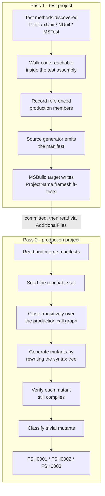

# NetEvolve.FrameShift

[](https://www.nuget.org/packages/NetEvolve.FrameShift/)
[](https://www.nuget.org/packages/NetEvolve.FrameShift/)
[](https://github.com/dailydevops/frameshift/blob/main/LICENSE)

FrameShift is a Roslyn analyzer package that reports mutation-testing gaps in C# code at build time,
without executing a single test. It mutates the production syntax tree in memory, checks whether any
discovered test can reach the mutated code, and warns where a surviving mutant would go unnoticed.
It is for teams who want the signal of mutation analysis inside the normal build and in the IDE,
next to every other compiler diagnostic.

## Features

- Build-time gap detection - the analysis runs inside the compiler, so nothing is executed,
  scheduled or spawned, and the result appears in the build log and in the IDE error list.
- 14 mutation operators covering arithmetic operators and compound assignments, relational and
  equality operators, logical, conditional and bitwise/shift operators, logical negation,
  increment/decrement, unary operators, null-coalescing, and boolean, numeric and string literals.
- Every mutant is verified by in-memory recompilation of the mutated syntax tree, so a mutation that
  would not even build is never reported.
- Mutants that cannot change observable behaviour are recognised and reported separately
  (`FSH0002`), each with the reason why - for example that the mutated expression folds to the same
  constant, or that the mutated value is never consumed.
- Test discovery for TUnit, xUnit, NUnit and MSTest, with each framework adapter staying silent on
  compilations that are not its own.
- A self-maintaining test-surface manifest: a source generator produces it from the test project and
  a packaged MSBuild target writes it next to the project file, so it never has to be edited by hand.
- Reachability is closed transitively over the production call graph, including an approximation of
  virtual and interface dispatch, so a member that is only reached indirectly still counts as tested.
- Configurable through plain MSBuild properties and, like every analyzer, through
  `.editorconfig` severities.

## Installation

Both halves of the analysis ship in the same package, but they run in different projects: the test
project produces the test-surface manifest, and the production project consumes it and does the
mutation analysis. **Reference the package in both projects.**

### NuGet Package Manager

```powershell
Install-Package NetEvolve.FrameShift
```

### .NET CLI

```bash
dotnet add package NetEvolve.FrameShift
```

### PackageReference

The production project - the project whose code is mutated and reported on:

```xml
<ItemGroup>
  <PackageReference Include="NetEvolve.FrameShift" Version="x.x.x" PrivateAssets="all" />
</ItemGroup>
```

The test project - the project whose tests are discovered and whose manifest is written:

```xml
<ItemGroup>
  <PackageReference Include="NetEvolve.FrameShift" Version="x.x.x" PrivateAssets="all" />
</ItemGroup>
```

## Quick Start

1. Reference `NetEvolve.FrameShift` in the production project and in the test project.
2. Build the test project once. This writes
   `$(MSBuildProjectName).frameshift-tests` next to the test project file.
3. Point the production project at that manifest and build it. The `FSH0001` warnings are the gaps.
4. Commit the manifest - it is the input of the next build of the production project.

Step 3, in the production project:

```xml
<ItemGroup>
  <AdditionalFiles Include="..\..\tests\Calculator.Tests\Calculator.Tests.frameshift-tests" />
</ItemGroup>
```

Alternatively, let the test project write its manifest directly into the production project
directory, where the package picks it up automatically:

```xml
<PropertyGroup>
  <FrameShiftTestSurfaceManifestFile>$(MSBuildThisFileDirectory)..\..\src\Calculator\Calculator.frameshift-tests</FrameShiftTestSurfaceManifestFile>
</PropertyGroup>
```

### Worked example

`src/Calculator/Rates.cs`:

```csharp
namespace Calculator;

public sealed class Rates
{
    public decimal WithTax(decimal amount) => amount * 1.19m;

    public decimal WithDiscount(decimal amount) => amount - (amount * 0.1m);
}
```

`tests/Calculator.Tests/RatesTests.cs` - only `WithTax` is tested:

```csharp
namespace Calculator.Tests;

public sealed class RatesTests
{
    [Test]
    public async Task WithTax_AddsNineteenPercent() =>
        await Assert.That(new Rates().WithTax(100m)).IsEqualTo(119m);
}
```

Building the test project writes `tests/Calculator.Tests/Calculator.Tests.frameshift-tests`. The
format is plain text: a mandatory header line, then one line per discovered test method prefixed
with `T`, then one line per referenced member prefixed with `R`. Both groups are sorted ordinally,
the ids are documentation comment ids, and lines starting with `#` are comments:

```text
frameshift-test-surface/1
T M:Calculator.Tests.RatesTests.WithTax_AddsNineteenPercent
R M:Calculator.Rates.#ctor
R M:Calculator.Rates.WithTax(System.Decimal)
R T:Calculator.Rates
```

This is an excerpt. The real file also records the members the test touched in every *other*
referenced assembly - the test framework, the base class library - because the collector records
everything that comes from outside the test compilation. Those ids simply do not resolve in the
production compilation and are ignored there.

Building the production project then reports the untested method. One warning is emitted per
*mutant*, not per mutation point, so a single expression usually produces several of them at the
same location - the arithmetic operator alone is replaced by each of the four remaining operators.
Two of the warnings for `WithDiscount`:

```text
src\Calculator\Rates.cs(7,52): warning FSH0001: Mutation '- => +' at this location is not reachable from any test; a surviving mutant here would go unnoticed
src\Calculator\Rates.cs(7,62): warning FSH0001: Mutation '* => /' at this location is not reachable from any test; a surviving mutant here would go unnoticed
```

`WithTax` produces no `FSH0001`, because the manifest records it and the mutation points inside it
are therefore reachable.

## How it works

The analysis is split into two passes because neither compilation can see the whole picture.

A test compilation references the production assembly as **metadata only**. It can name the
production members its test methods touch, but it owns no production syntax tree, so it cannot
mutate anything and it cannot see which further members those touched members call. A production
compilation owns every syntax tree and the complete call graph, but it **cannot see a single test**.

The manifest is the bridge between the two. It is therefore a build artifact of a previous pass over
the test project, and it is meant to be committed: the production build hands it to the compiler as
an `@(AdditionalFiles)` item, the standard channel for giving an analyzer a non-C# input. Because it
is generated rather than hand-written, it stays correct as the tests change - and whenever a manifest is present,
the test-side analyzer compares it against the surface it just collected and reports `FSH0003` when
the two no longer match.

The reachability closure runs on the production side, and it has to: the manifest only transports the
*seed*, the members a test touches directly. Expanding that seed into everything those members call
requires the production call graph, which only the production compilation can see. The expansion is a
breadth-first walk over the declarations in this compilation, with virtual and interface dispatch
approximated by adding the overrides and implementations declared here.



A production project that has no manifest at all stays completely silent, because it has not opted
in; the MSBuild assets emit `FSH0005` for the missing setup instead.

## Configuration

Every property is set in the consuming project, in a `Directory.Build.props`, or on the command line
via `-p:Name=Value`.

| Property | Default | Effect |
| --- | --- | --- |
| `FrameShiftEnabled` | `true` | Runs the analysis at all. `false` disables the analyzers and the manifest generator for the project. |
| `FrameShiftVerifyMutantCompilation` | `true` | Compiles every mutant before it is reported. `false` skips the verification and reports mutants that may not build. |
| `FrameShiftMaxMutantsPerMember` | `64` | Caps the mutants considered for a single member. Values below `1` are clamped to `1`. |
| `FrameShiftReportTrivialMutants` | `true` | Reports mutants without observable effect as `FSH0002`. `false` keeps them out of the build log. |
| `FrameShiftSuppressSetupWarning` | `false` | Silences the `FSH0005` setup warning, for example for a project that is deliberately not covered, or while the manifest of the first pass does not exist yet. |
| `FrameShiftIsTestProject` | *(unset)* | Set to `true` to mark a project as a test project, which suppresses `FSH0005` for it. Read only by the targets, never by the analyzers. `$(IsTestProject)` and `$(IsTestingPlatformApplication)` have the same effect. |
| `FrameShiftEnableDefaultManifestItems` | `true`, or `false` when `$(EnableDefaultItems)` is `false` | Adds every `**/*.frameshift-tests` file of the project directory to `@(AdditionalFiles)`, excluding the output and intermediate directories. |
| `FrameShiftWriteTestSurfaceManifest` | `true` for a project referencing a known test framework package (a `PackageReference` whose id starts, case-insensitively, with `tunit`, `xunit`, `nunit` or `mstest`), `false` otherwise | Writes the generated test-surface manifest next to the project file. Enabling it turns on `$(EmitCompilerGeneratedFiles)`. |
| `FrameShiftTestSurfaceManifestFile` | `$(MSBuildProjectDirectory)\$(MSBuildProjectName).frameshift-tests` | The manifest file that is written. |

The first four properties are exposed to the analyzers as `build_property.<Name>`; a value that
cannot be parsed falls back to the documented default. In a multi-targeting test project exactly one
inner build writes the manifest, namely the one building the first entry of `$(TargetFrameworks)`.

Severities are changed like those of any other analyzer, in `.editorconfig`:

```ini
[*.cs]
# Treat an untested mutation point as an error.
dotnet_diagnostic.FSH0001.severity = error

# Hide the informational mutants.
dotnet_diagnostic.FSH0002.severity = none
```

## Diagnostics

| Id | Default severity | Meaning |
| --- | --- | --- |
| [FSH0001](../../docs/rules/FSH0001.md) | Warning | A mutation point is not reachable from any test, so a surviving mutant there would go unnoticed. |
| [FSH0002](../../docs/rules/FSH0002.md) | Info | The mutant cannot change observable behaviour, so no test could ever distinguish it. |
| [FSH0003](../../docs/rules/FSH0003.md) | Warning | The test-surface manifest is missing, malformed or stale. |
| [FSH0004](../../docs/rules/FSH0004.md) | Info | A test method does not reference any production member. |
| [FSH0005](../../docs/rules/FSH0005.md) | MSBuild warning | The project has no test-surface manifest, so the analysis cannot do anything. |

## Limitations

- The reachability closure is a compile-time, side-effect-free approximation. It does not follow
  reflection (`Type.GetMethod`, `Activator`, expression trees compiled at run time), dependency
  injection registrations, or dynamic dispatch through delegates stored in fields, properties or
  collections. It also does not reason about source generators: generated trees are walked like any
  other tree, but generated members that no source code references stay unreachable. Members without
  a declaring syntax in the compilation - most notably implicitly declared default constructors -
  contribute no outgoing references.
- Every one of those limitations errs towards reporting a gap that a human can dismiss, rather than
  silently claiming coverage that does not exist. Expect to suppress some `FSH0001` warnings.
- The manifest is only as fresh as the last build of the test project. Until the test project is
  rebuilt and the new manifest committed, the production build judges the code against the previous
  test surface. `FSH0003` catches the case where the manifest no longer matches the tests, or no
  longer resolves against the production compilation at all.
- Verifying every mutant by recompiling the mutated syntax tree is by far the most expensive step of
  the analysis. Only the mutated tree is re-bound, never the whole compilation, and results are
  memoised - the price of that shortcut is that a mutation which invalidates code in a *different*
  file is accepted as viable. Set `FrameShiftVerifyMutantCompilation` to `false` to trade
  correctness for build time, or lower `FrameShiftMaxMutantsPerMember`.
- Collecting a test surface means walking every syntax tree of the test project with a semantic
  model, so the generator depends on the whole compilation and re-runs on every build and on every
  keystroke in the IDE. Its cost grows with the size of the test project. Set `FrameShiftEnabled` to
  `false`, or `FrameShiftWriteTestSurfaceManifest` to `false`, if that cost is not wanted.
- C# only, and reachability never leaves the analysed compilation: overrides in other assemblies are
  outside what a single compilation can observe.

## Requirements

- A C# project built with a toolchain that ships Roslyn 4.14 or newer - .NET SDK 9.0.300 or Visual
  Studio 2022 17.14 and above. The analyzed projects themselves can target any framework.
- A test project using TUnit, xUnit, NUnit or MSTest.
- No runtime dependency: the package is a development dependency and contributes nothing to the
  output of the projects that reference it.

## Documentation

For complete documentation, please visit the [official documentation](https://github.com/dailydevops/frameshift/blob/main/README.md).

## Contributing

Contributions are welcome! Please read the [Contributing Guidelines](https://github.com/dailydevops/frameshift/blob/main/CONTRIBUTING.md) before submitting a pull request.

## Support

- **Issues**: Report bugs or request features on [GitHub Issues](https://github.com/dailydevops/frameshift/issues)
- **Documentation**: Read the full documentation at [https://github.com/dailydevops/frameshift](https://github.com/dailydevops/frameshift)

## License

This project is licensed under the MIT License - see the [LICENSE](https://github.com/dailydevops/frameshift/blob/main/LICENSE) file for details.

---

> [!NOTE]
> **Made with ❤️ by the NetEvolve Team**
> Visit us at [https://www.daily-devops.net](https://www.daily-devops.net) for more information about our services and solutions.